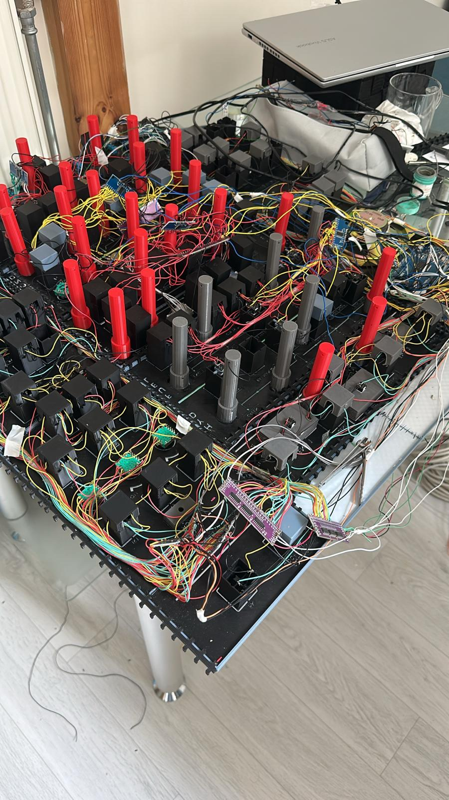

# 🛫 A320 Cockpit – Home Built Overhead Panel
🔹 Panel lit up

This is my personal DIY project to build a realistic Airbus A320 FWD Overhead Panel using:
- 🔧 **3D printing** (Bambu Lab A1 Combo with multi-color)
- 🔌 **Arduino Mega + MobiFlight**
- 💡 **LEDs with backlighting and PWM dimming**
- 🎛️ **Fully functional Korry switches (ON / FAULT / AVAIL)**
- 🧠 **Multiplexers (CD74HC4067) for input expansion**

---

## ✨ Features

✅ Printed with **0.2mm nozzle** for precise engraving  
✅ Panel layout divided into **Left / Center / Right** — with realistic tilt  
✅ **Backlit labels** in warm amber (like real A320)  
✅ Custom-designed knobs and toggles  
✅ Real-time sync with **Microsoft Flight Simulator 2020** via MobiFlight  
✅ Over 300 wires hand-routed 😅  
✅ All done without a laser cutter — 100% 3D printed!

---

## 📂 Repository Contents

